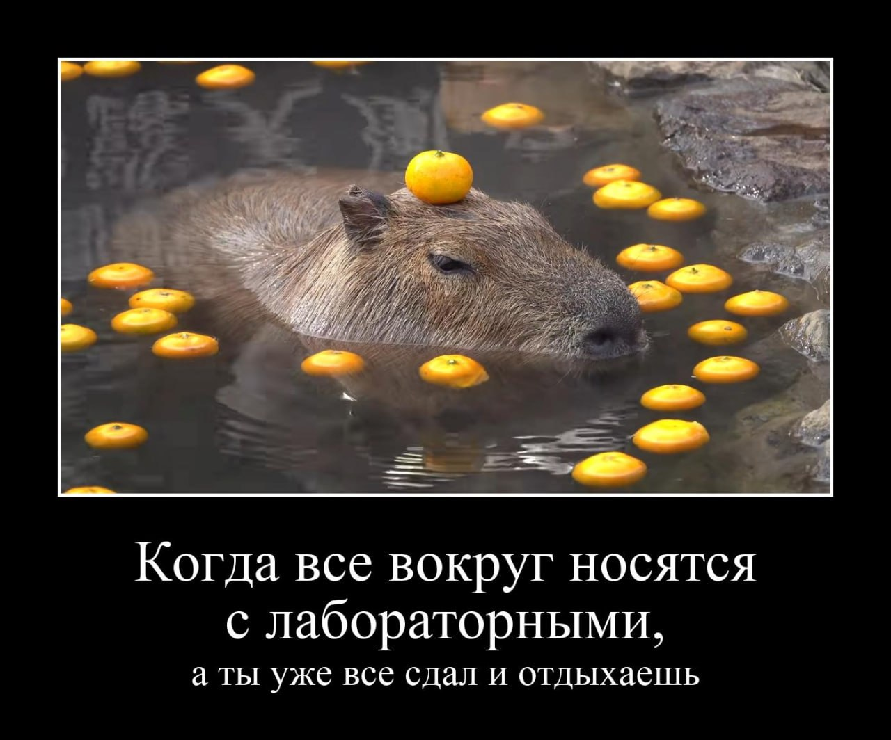

# Создание редактора демотиваторов

## Содержание

1. [Введение](#Введение)
2. [Ход работы](<#Ход работы>)
3. [Результат работы](<#Результат работы>)
4. [Дополнительное задание](<#Дополнительное задание>)
5. [Дополнительные источники](<#Дополнительные источники>)

## Введение

В данной лабораторной вы познакомитесь с модулем Python Pillow и его следующими 
модулями:

1. Image - основной модуль.
2. ImageFont - сохраняет информацию о загруженном шрифте.
3. ImageDraw - добавление текста и новых изображений.

Ваша задача: создать простой редактор изображений, с которым можно создавать 
демотиваторы.

Демотиваторы состоят из следующих частей:

1. Оригинальное изображение.
2. Чёрная рамка вокруг изображения.
3. Текст под оригинальным изображением: заголовок и подзаголовок.

Вам необходимо обеспечить принятие ввода пользователя через консоль: он выбирает 
изображение и задаёт текст. 

Выполнив данную работу вы проявите креативность, укрепите знания Python и
изучите основы Pillow, применяя документацию.

## Ход работы

Лабораторная работа выполняется через следующие функции:

1. Image.open - открыть изображение из файла.
2. Image.save - сохранить изображение.
3. Image.new - создать новое изображение.
4. Image.paste - вставить изображение на заданных координатах.
5. Image.thumbnail - уменьшить размер изображения до максимально положенного.
6. ImageDraw.Draw.text - вставить текст на изображение.

Могут быть использованы другие функции Pillow при необходимости по вашему выбору.

Подходы к выполнению задания могут быть самыми разными, поэтому подробная инструкция
с примером не приводится. Тем не менее, вам предоставлены следующие пункты,
на которые можно опереться:

### Импорт изображения

Открывается оригинальное изображение:
```
вашеизображение = Image.open("путькфайлу")
```

Необходимо проверить, указан ли правильный путь к файлу. 

Стоит учесть размер изображения: вероятно, надо задать максимальный 
возможный размер и уменьшать до него картинку:
```
вашеизображение.thumbnail(максимальный размер)
```

### Рамки демотиватора

Выполнение данного пункта лежит на вас и вашей креативности.

<details>
<summary>Подсказка: </summary>

    Можно использовать функции Image.new и Image.paste или функцию expand из модуля ImageOps.
</details>

Перед созданием чёрной рамки вы можете задавать белую рамку изображению для
чёткого разделения между ним и фоном.

### Текст

Загружается шрифт через модуль ImageFont, задаются 2 разных шрифта: для
заголовка и для подзаголовка (отличаются только размером!).


Необходимо добавить текст на демотиватор, сначала заголовок с большим размером 
шрифта, затем подзаголовок с маленьким. Это выполняется так:

```
вашеизоdraw = ImageDraw.Draw(вашеизображение)
вашеизоdraw.text(координаты, text="ваштекст", font=вашшрифт, fill=белый цвет)
```

Но сначала необходимо прописать перенос строк! Подумайте, как.

<details> 
<summary>Подсказка: </summary>
    
    Вам может помочь модуль textwrap.
</details>

Также стоит учесть, что текст может выйти за заданную рамку демотиватора. Подумайте,
как решить эту проблему.
<details> 
<summary>Подсказка: </summary>
    
    Что-то стоит делать с вводом пользователя?
    Может, что-то сделать с рамкой? До или после её создания?
</details>

Необходимо также разместить текст по центру, задав нужные координаты. Поразмышляйте,
как.

## Результаты работы

В итоге у вас получится программа Python, в которой пользователь может написать
путь к изображению, заголовок и/или подзаголовок и получить на выходе готовый
демотиватор.

По завершению загрузите ваш отчёт со своими примерами сделанных демотиваторов.

Необходимо сделать в вашей программе демотиватор на основе изображения capybara-onsen.jpg
из репозитория со следующим текстом:

> Когда все вокруг носятся с лабораторными,

> а ты уже всё сдал и отдыхаешь

Вы можете сравнить результат с capybara-demotivator.jpg из репозитория. Размер шрифта и рамок, отступы можно поменять по своему вкусу.



Загрузите получившийся демотиватор, свои примеры и код программы в репозиторий.

## Дополнительное задание

Придумайте, как добавлять новые уровни к полученному демотиватору.

Добавьте к демотиватору с капибарой ещё 1 уровень с текстом:

> Или просто забил,

> каждому своё

Загрузите результат в репозиторий.

## Дополнительные источники

* Документация Python Pillow https://python-pillow.org/
